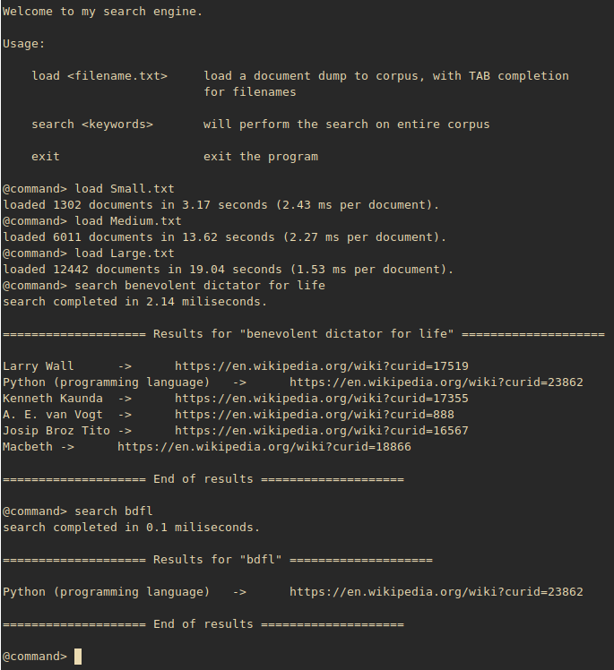

# wiki-search-engine

This is a simple cli search engine that works on wikipedia document corpus 
files that is written in `python`. It implements a relevance-sorted search
through the wikipedia articles that are parsed from the user selected corpus file.
For simplicity, only the articles that include all search terms are returned.

## Getting started

To test the program, clone the parent repository (`course-projects`) and extract 
the archive `corpus-samples.tar.gz`. This includes three corpus samples with varying
file sizes. After that, you can call the program with `python3 searcEngine.py`
and let the user interface guide you through.

Below, you can find a screenshot from a test run.

